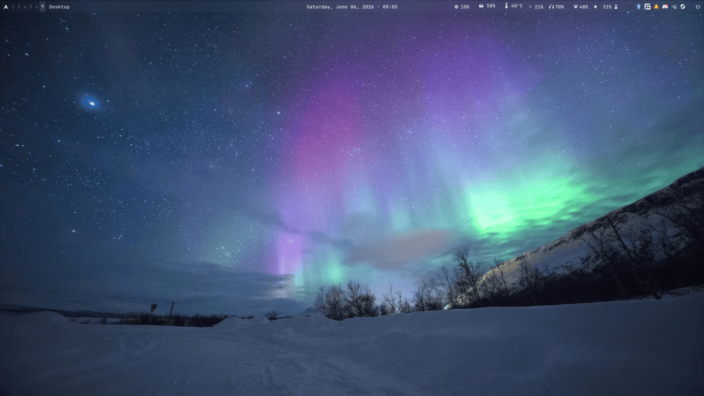
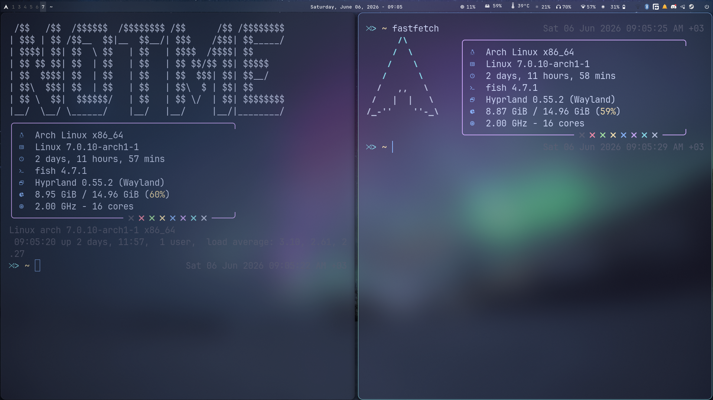
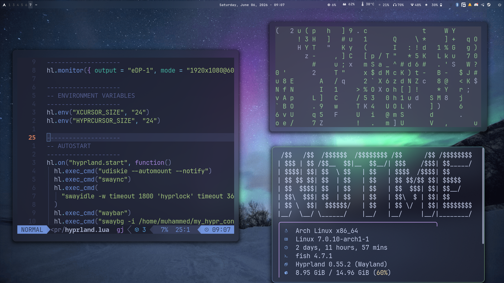

# My Hyprland dotfiles for Hyprland (0.55+):P

the app you will need/be using with this config:
* **Window Manager:** Hyprland (v0.55+)

### Core Applications
* **Terminal:** kitty
* **File Manager:** yazi (TUI)
* **Menu:** wofi
* **Web Browser:** firefox
* **Text / Code Editors:** neovim (via `kitty nvim`), vscodium

### UI
* **Status Bar:** waybar
* **Notification Daemon:** swaync (SwayNotificationCenter)
* **Session Logout Menu:** wlogout
* **Wallpaper Daemon:** swaybg
* **Display Temperature (Blue Light Filter):** gammastep

### Daemons and system apps
* **Idle Management:** swayidle
* **Screen Locker:** hyprlock
* **Clipboard Manager:** cliphist, wl-clipboard
* **Storage Automounting:** udiskie
* **Network Manager:** network_manager / nm-connection-editor
* **Bluetooth Manager:** blueman-manager
* **Audio Control:** wireplumber (`wpctl`), pavucontrol
* **Brightness Control:** brightnessctl
* **Media Controller:** playerctl
* **Screenshot Utility:** quickshell (running the `hyprquickshot` config)

### Gaming & soical apps
* **Gaming apps:** lutris, steam
* **Chatting apps:** telegram-desktop, discord

### Miscellaneous
* **Calculator:** gnome-calculator

you can installed these by running this on your arch machine:
```bash
sudo pacman -S hyprland kitty alacritty wofi firefox vscodium waybar swaync wlogout swaybg gammastep swayidle hyprlock cliphist wl-clipboard udiskie network-manager-applet blueman pavucontrol brightnessctl playerctl lutris steam telegram-desktop discord gnome-calculator

yay -S yazi quickshell-git
```

Some screenshots:


<table width="100%">
  <tr>
    <td width="50%">
      <p align="center"><b>System Info (Fastfetch)</b></p>
      
    </td>
    <td width="50%">
      <p align="center"><b>Tiling & Windows (Multi-Terminals)</b></p>
      
    </td>
  </tr>
</table>
